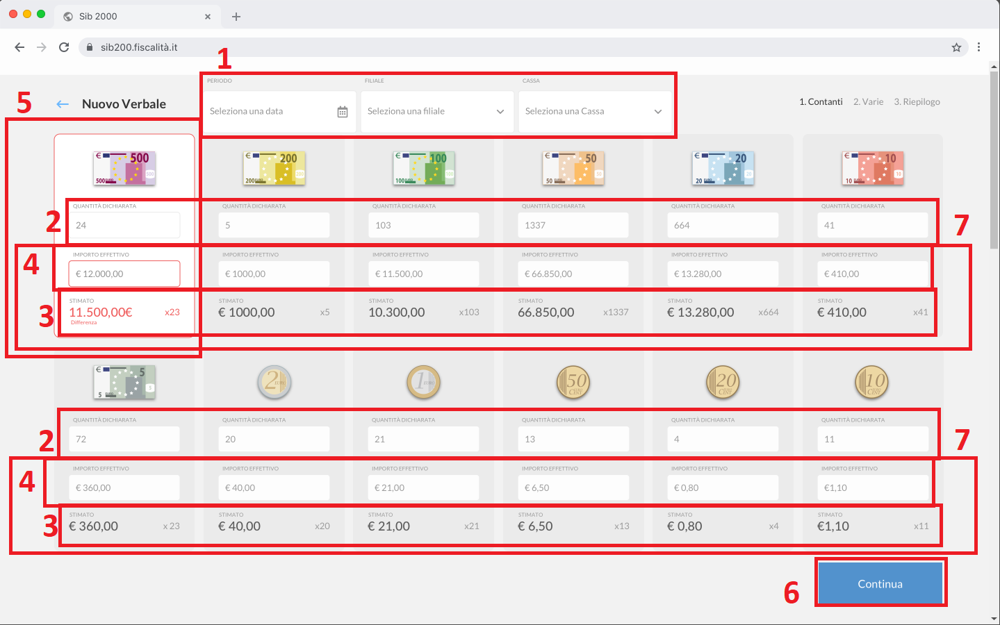

# GUI Capabilities & Validation 

## Gestione verbali di cassa

1. **Periodo**
    - capability:
        - impostazione di una data di filtro della lista dei verbali
    - validation / behaviour:
        - un solo valore
        - qualsiasi valore minore della data odierna
2. **Filiale**
    - capability:
        - impostazione della filiale di filtro della lista dei verbali
    - validation / behaviour:
        - un solo valore
        - selezionato dall'elenco delle filiali della banca 
3. **Cassa**
    - capability:
        - impostazione della cassa di filtro della lista dei verbali
    - validation / behaviour:
        - un solo valore
        - selezionato dall'elenco delle casse della filiale selezionata in **2**
4. **Filiale + Cassa**
    - capability:
        - impostazione di filiale e cassa di filtro della lista dei verbali
    - validation / behaviour:
        - la coppia di valori deve essere appartenere all'intersezione degli insiemi delle filiali della banca e delle casse di tali filiali
5. **Stampa**
    - capability:
        - Produzione della stampa cartacea di uno o più verbali di cassa
    - validation / behaviour:
        - la stampa è sempre consentita da pulsante o da menu per qualsiasi verbale / elenco di verbali selezionato (cfr. punto 8)
6. **Nuovo Verbale**
    - capability:
        - inserimento di un nuovo verbale di cassa
    - validation / behaviour:
        - azione consentita sempre
7. **Context Menu**
    - capability:
        - visualizzazione delle operazioni possibili per il verbale selezionato
    - validation / behaviour:
        - per tutti i vebrali è possibile eseguire la visulizzazione del dettaglio e la stampa cartacea (capability come **5**)
8. **Selezione multipla**
    - capability:
        - selezione di più verbali per operatività multipla
    - validation / behaviour:
        - è ammessa la selezione di qualsiasi insieme di verbali stampati e non
        - l'insieme dei verbali selezionati deve appartenere ad una singola pagina
9. **Colonna Filiale**
    - capability:
        - esposizione del solo identificativo della filiale a cui il verbale si riferisci

## Gestione delle giacenze di contante messe a verbale

1. **Periodo + Filiale + Cassa**
    - capability:
        - impostazione dei valori di data, filiale e cassa a cui il verbale si riferisce
    - validation / behaviour:
        - per i campi valgono le stesse regole citate nei punti **1**, **2**, **3**, **4** di **Gestione verbali di cassa**
        - i campi sono modificabili sono da utenti aventi l'abilitazione di utente master in [Analisi di dominio](analisi-dominio.md)
2. **Quantità dichiarata**
    - capability:
        - imputazione da parte dell'operatore della quantità di contante che si dichiara essere presente in cassa
    - validation / behaviour:
        - ammessi solo valori maggiori o uguali a zero
3. **Stimato**
    - capability:
        - esposizione della giacenza presente in cassa in base al dato presente in procedura in termini di quantità e importo totale
    - validation / behaviour:
        - campo di sola lettura
        - il valore è determinato dalla logica spiegata in [Analisi di dominio](analisi-dominio.md)
        - a fronte di un valore diverso da quello **Importo effettivo** si evidenzia il campo in errore come esposto con messaggio "Differenza"
4. **Importo effettivo**
    - capability:
        - visualizzazione dell'importo effettivo calcolato in base alla quantità dichiarata
    - validation / behaviour:
        - il valore è pari al risultato di `(quantità dichiarata x valore di riferimento)`
        - a fronte di un valore diverso da quello **Stimato** si evidenzia il campo in errore come esposto
5. **Gruppo di campi per singola voce di contante**
    - capability:
        - esposizione dei dati relativi ad un taglio di contante e raccolta dall'utente del valore dichiarato
    - validation / behaviour:
        - visualizzazione dell'immagine relativa al taglio di contante
        - effettuazione dei calcoli in base al valore di riferimento dell'entità di dominio (vedi [Analisi di dominio](analisi-dominio.md))
6. **Continua**
    - capability:
        - conclusione dell'immissione dati per i tagli di contante e moneta
    - validation / behaviour:
        - azione sempre possibile
7. **Campi Importo effettivo + Stimato**
    - capability:
        - visualizzazione dati di comparazione fra importi dichiarati e giacenze 
    - validation / behaviour:
        - dati di sola lettura

## Gestione delle giacenze "varie" messe a verbale

1. **Identificativo della voce di giacenza**
    - capability:
        - immagine identificativa della voce di giacenza di cassa identificata dalla codifica opportuna (vedi [Analisi di dominio](analisi-dominio.md)) 
    - validation / behaviour:
        - visualizzazione dell'immagine relativa al taglio di contante
        - effettuazione dei calcoli in base al valore di riferimento dell'entità di dominio (vedi [Analisi di dominio](analisi-dominio.md))
2. **Quantità dichiarata + Importo effettivo**
    - capability:
        - imputazione da parte dell'operatore della quantità di giacenza che si dichiara essere presente in cassa per la voce in oggetto
    - validation / behaviour:
        - ammessi per la quantità solo valori maggiori o uguali a zero
        - campo importo effettivo di sola lettura
3. **Stimato**
    - capability:
        - esposizione della giacenza presente in cassa in base al dato presente in procedura in termini di quantità e importo totale
    - validation / behaviour:
        - campo di sola lettura
        - il valore è determinato dalla logica spiegata in [Analisi di dominio](analisi-dominio.md)
        - a fronte di un valore diverso da quello **Importo effettivo** si evidenzia il campo in errore come esposto con messaggio "Differenza"
4. **Aggiungi**
    - capability:
        - aggiunta al verbale di una voce custom di giacenza di valori in cassa
    - validation / behaviour:
        - sempre possibile
        - obbliga alla compilazione per la voce creata del campo **Importo effettivo** a discrezione dell'operatore
        - determina la nascita di una nuova voce di cassa con generazione di apposito identificativo
5. **Indietro**
    - capability:
        - ritorno alla view di imputazione giacenze di contante
    - validation / behaviour:
        - azione sempre possibile
6. **Continua**
    - capability:
        - conclusione dell'immissione dati per i tagli di giacenza varie
    - validation / behaviour:
        - azione sempre possibile
    
## Riepilogo dati del verbale di cassa

1. **Saldo contabile di cassa**
    - capability:
        - visualizzazione dal saldo di contabilità legato al mastro contabile della filiale + cassa selezionate 
    - validation / behaviour:
        - dato di sola lettura
        - valore determinato dalla lettura del saldo di contabilità descritta in [Analisi extra dominio](analisi-extra-dominio.md)
        - per l'interpretazione del segno algebrico si veda [Analisi di dominio](analisi-dominio.md)
2. **Saldo giacenza**
    - capability:
        - visualizzazione dal totale della giacenza in cassa dichiarata dall'operatore 
    - validation / behaviour:
        - dato di sola lettura
        - valore determinato dalla somma dei totali ottenuti in **Gestione delle giacenze di contante messe a verbale** e **Gestione delle giacenze "varie" messe a verbale**
        - per l'interpretazione del segno algebrico si veda [Analisi di dominio](analisi-dominio.md)
3. **Differenza**
    - capability:
        - visualizzazione dalla differenza fra **Saldo contabile di cassa** e **Saldo giacenza**
    - validation / behaviour:
        - dato di sola lettura
        - valore pari a `(Saldo contabile di cassa - Saldo giacenza)`
        - per l'interpretazione del segno algebrico si veda [Analisi di dominio](analisi-dominio.md)
4. **Banconote**
    - capability:
        - visualizzazione della giacenza totale immessa dall'operatore sulle voci relative a banconote
    - validation / behaviour:
        - dato di sola lettura
        - valore pari al totale degli importi effettivi tratti da **Gestione delle giacenze di contante messe a verbale** nel range di valori nominali da `€ 500,00` a `€ 5,00`
5. **Monete**
    - capability:
        - visualizzazione della giacenza totale immessa dall'operatore sulle voci relative a moneta
    - validation / behaviour:
        - dato di sola lettura
        - valore pari al totale degli importi effettivi tratti da **Gestione delle giacenze di contante messe a verbale** nel range di valori nominali da `€ 2,00` a `€ 0,01`
6. **Preconfezionati**
    - capability:
        - visualizzazione della giacenza totale immessa dall'operatore sulle voci relative a rotoli preconfezionati di moneta
    - validation / behaviour:
        - dato di sola lettura
        - valore pari al totale degli importi effettivi tratti da **Gestione delle giacenze "varie" messe a verbale** per le entità aventi valore nominale nel range da `€ 2,00` a `€ 0,01` e definite come rotoli preconfezionati (si veda [Analisi di dominio](analisi-dominio.md))
7. **Altro**
    - capability:
        - visualizzazione della giacenza totale immessa dall'operatore sulle voci relative ad altro
    - validation / behaviour:
        - dato di sola lettura
        - valore pari al totale degli importi effettivi tratti da **Gestione delle giacenze "varie" messe a verbale** per le entità non appartenenti alle catogorie citate nei punti **Banconote**, **Monete**, **Preconfezionati**
8. **Totale**
    - capability:
        - visualizzazione degli importi effettivi di totale distinti per voce 
    - validation / behaviour:
        - valori di sola lettura
        - dettaglio delle voci pari all'elenco di tutti i valori da `€ 500,00` a `€ 0,01` + la voce `Altro` + la voce `Di cui logore`
        - valori esposti per ogni voce pari a:
            - Importo effettivo di ogni voce in base ai valori nominali
            - Importo effettivo per la voce `Di cui logore` pari alla somma degli importi effettivi tratti da **Gestione delle giacenze "varie" messe a verbale** per le entità appartenenti alla categoria `Logore` (si veda [Analisi di dominio](analisi-dominio.md)
9. **Stampa**
    - capability:   
        - attivazione della stampa alla conferma del verbale effettuata con pulsante **Conferma**  
    - validation / behaviour:
        - sempre possibile
        - alla sua pressione cambia il suo aspetto per evidenziare l'avvenuta selezione di preferenza da parte dell'operatore
10. **Indietro** 
    - capability:   
        - ritorno alla view di **Gestione delle giacenze "varie" messe a verbale** 
    - validation / behaviour:
        - sempre possibile
11. **Conferma**
    - capability:   
        - conferma di inserimento del verbale di cassa 
    - validation / behaviour:
        - sempre possibile
        - azioni eseguite alla pressione del pulsante
            - scrittura per persistere il verbale di cassa 
            - se l'operatore ha espresso il desiderio di produrre la stampa del verbale, produzione della stampa cartacea
            - se il verbale ha evidenziato una **Differenza** diversa da zero, produzione della scrittura contabile di rettifica (si veda [Analisi extra dominio](analisi-extra-dominio.md)
            - se il verbale ha evidenziato una o più differenze nelle giacenze in **Gestione delle giacenze di contante messe a verbale** o **Gestione delle giacenze "varie" messe a verbale**, aggiornamento delle giacenze con i nuovi valori