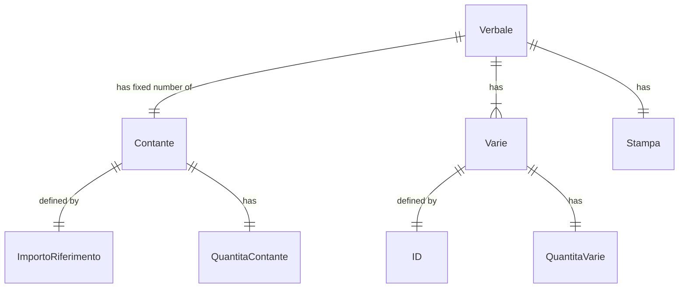
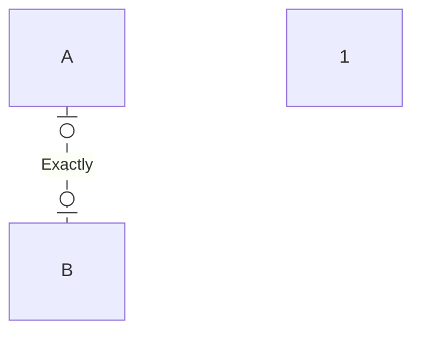

# Analisi di dominio

## ER diagrams
    


### Legenda significati relazione
```mermaid
erDiagram
    A |o..o| B : Zero or more
```

```mermaid
erDiagram
    A }o..o{ B : Zero or more (no upper limit)
```
```mermaid
erDiagram
    A }|..|{ B : One or more (no upper limit)
```

## Lettura giacenze di cassa

## Entità

## Vocabolario


