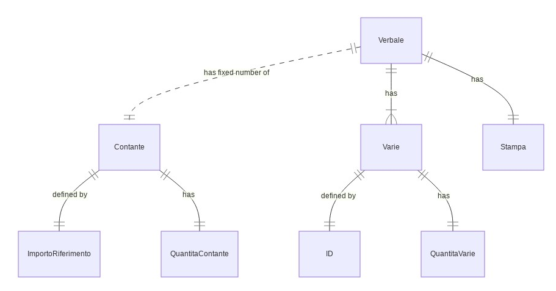

# Analisi di dominio

## Definizione entities e value objects

- Entities
  - verbale
  - taglio contante
  - taglio varie
  - *filiale*
  - [contabilità](https://link)
  - [impianti organizzativi](https://link)
- Value Objects
  - fatto amministrativo
  - mastro contabile
  - stampa verbale
  - giacenza di cassa
  - parametri di governo banca - ambito cassa
  - sessione

## Identificativi di entities e value objects
 
Se non diversamente specificato gli ID si intendono univoci a livello globale.

| **Entity / Value Object ** | **Identificativo** |
|---|---|
| verbale | ID |
| taglio contante | ID |
| taglio varie | ID |
| filiale | numero filiale |
| fatto amministrativo | tipo + anno + numero |
| mastro contabile | mastro + conto + sottoconto |
| stampa verbale | nessuno |
| giacenza di cassa | numero filiale + numero di cassa |
| parametri di governo banca - ambito cassa | nessuno |
| sessione | identificativo sessione |

## ER diagrams

## Interazioni

| **Da** | **interazione** | **A** |
|---|---|---|
| verbale | chiede la giacenza di sistema | giacenza di cassa |
| verbale | chiede i codici identificativi dei tagli | parametri di governo banca - ambito cassa |
| verbale | comunica la giacenza di sistema di ogni codice taglio | taglio contante / varie |
| verbale | legge la giacenza dichiarata | taglio contante / varie |
| verbale | aggiorna la giacenza | cassa |
| verbale | chiede l'utente attivo | sessione |
| verbale | verifica autorizzazioni per l'utente attivo | contabilità |
| verbale | chiede il mastro contabile della cassa in verbalizzazione | contabilità |
| verbale | chiede il mastro contabile per la registrazione di ammanchi | contabilità |
| verbale | chiede il mastro contabile per la registrazione di eccedenze | contabilità |
| verbale | chiede il saldo contabile del mastro della cassa in verbalizzazione | contabilità |
| verbale | esegue la scrittura contabile correttiva | contabilità |
| verbale | chiede elenco delle filiali della banca | impianti organizzativi |
| verbale | elenco delle casse censite su una filiale | filiale |

## Vocabolario / Ubiquitous Language

