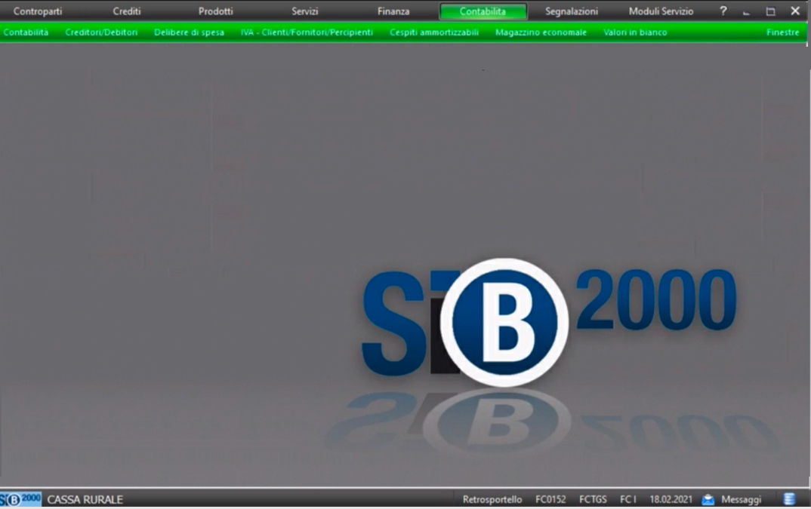
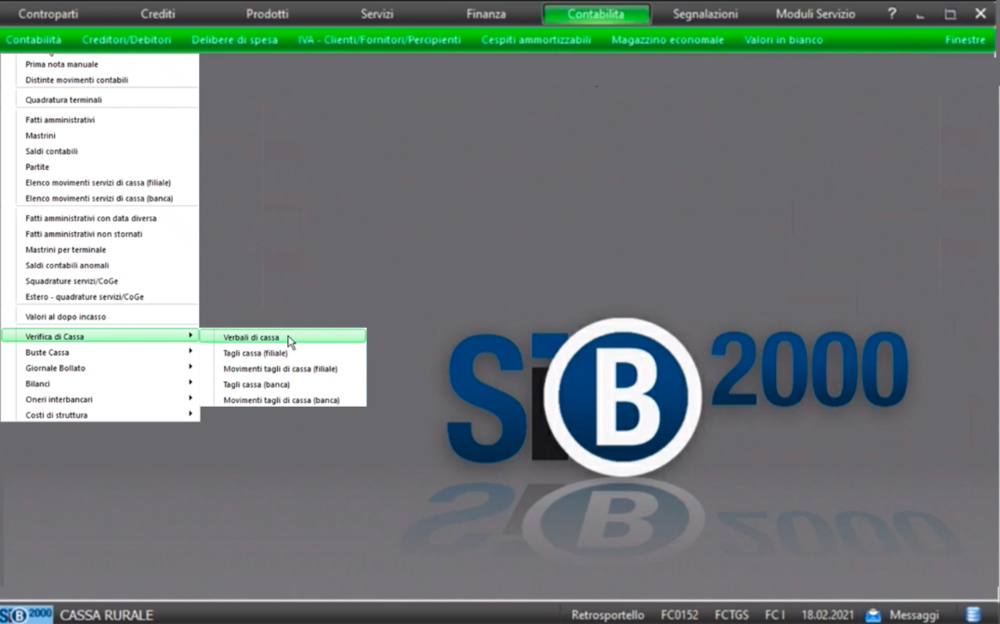
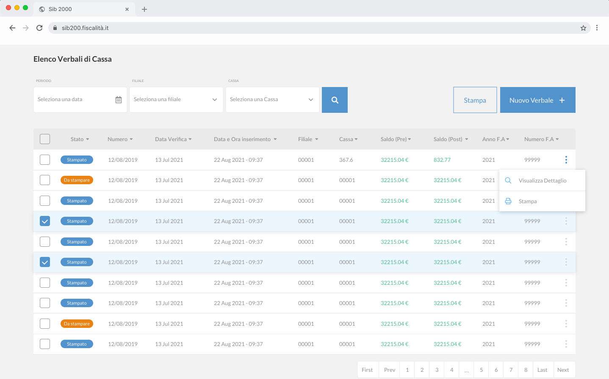
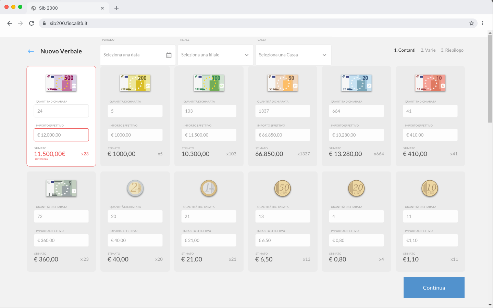
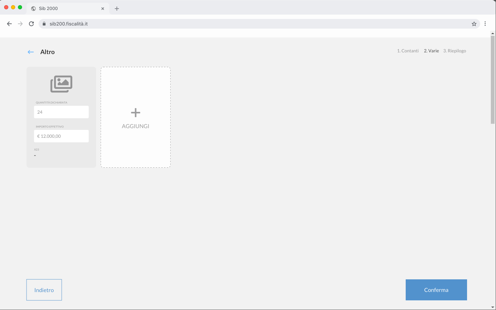
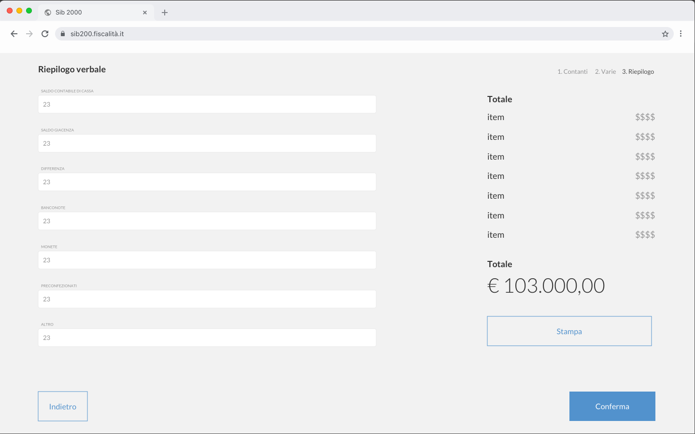

# Prototipi GUI

- selezione della voce di dekstop SIB2000 "Contabilità"

- selezione della voce di menu "Verifica di cassa"
- selezione della voce di menu "Verbale di cassa"

- gestione dei verbali di cassa

- gestione delle giacenze di contante messe a verbale

- gestione delle giacenze "varie" messe a verbale

- riepilogo dati del verbale di cassa

